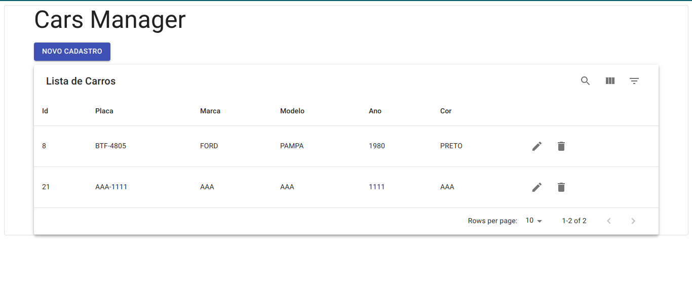
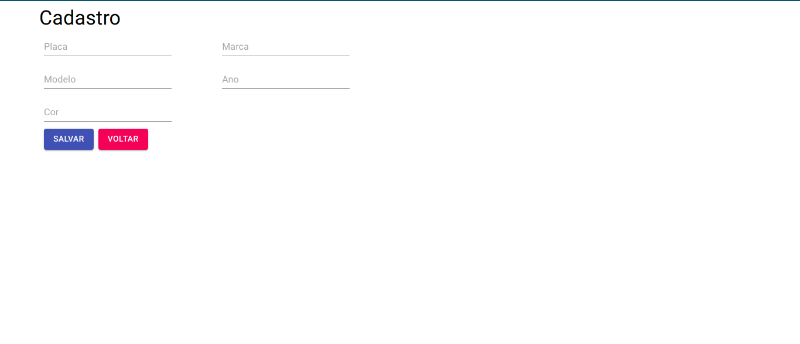

# cars-manager
## backend
 - NodeJS
 - Use `npm install` para instalar as dependencias 
 - `npm start` para iniciar o server

## frontend
- ReactJS
- `npm install` para instalar as dependencias
- `npm start` para iniciar o server

